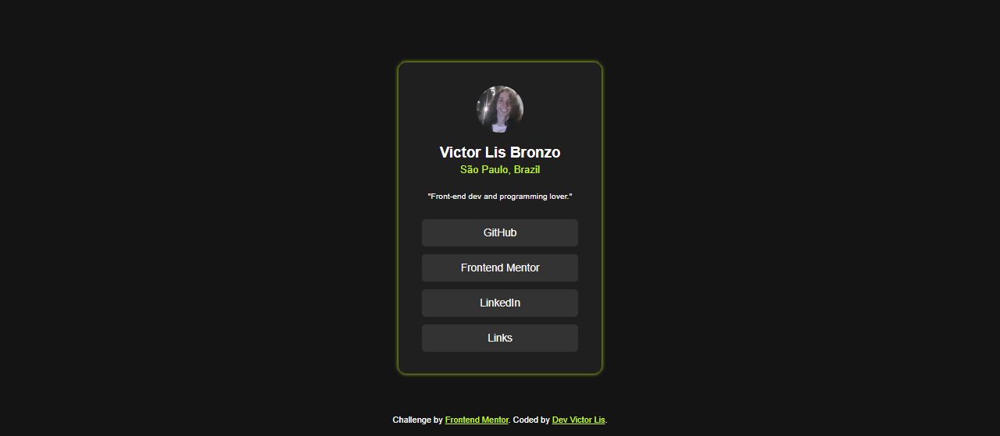
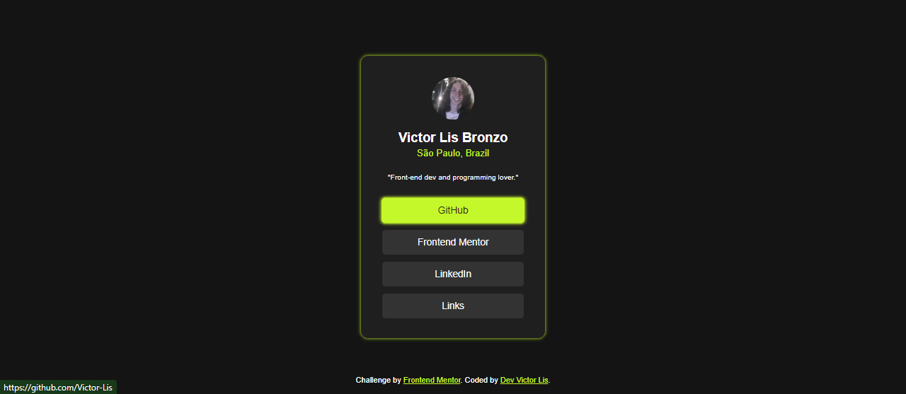

# Social Links Profile | Frontend Mentor - Challenge

Esse é mais um desafio de Front-End que realizo, dessa vez com o tema de realizar uma calculadora de idade.

## Desktop Design

## Desktop Result

## Mobile Design

  

## Mobile Result

  

## Hover Design

## Hover Result

# Resultado
Veja o [site](https://dev-victor-lis-social-links.netlify.app/)!

## Autores

[@Victor-Lis](https://github.com/Victor-Lis)
